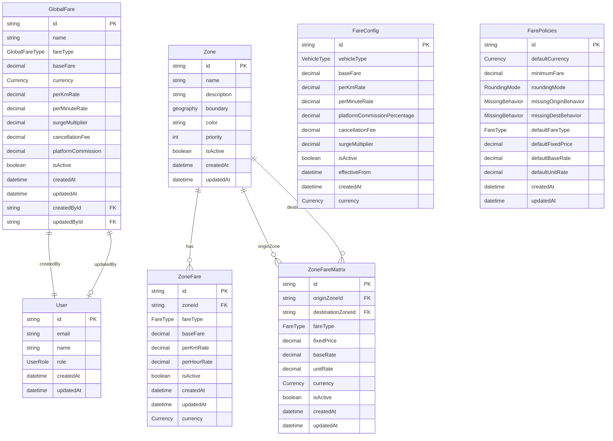
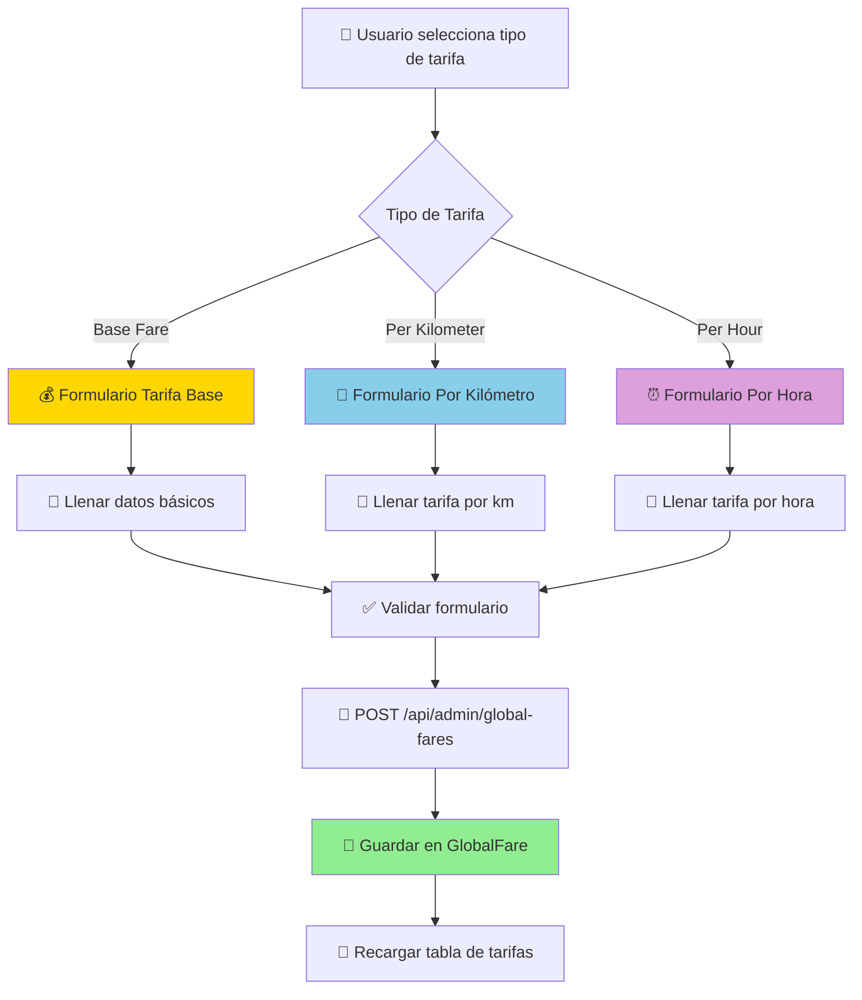
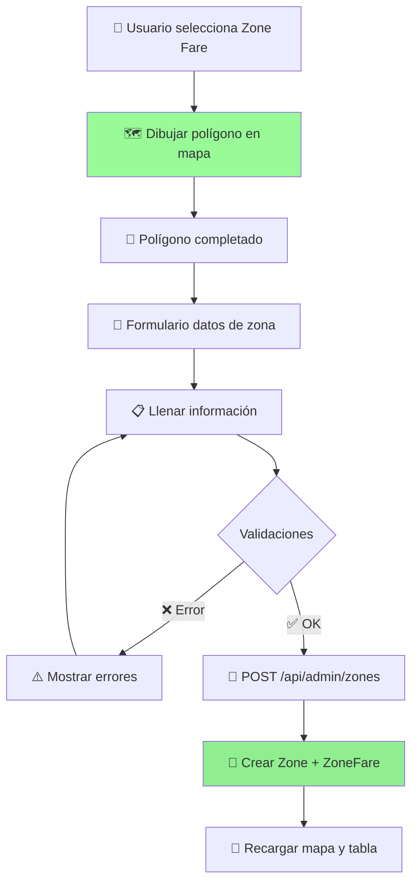
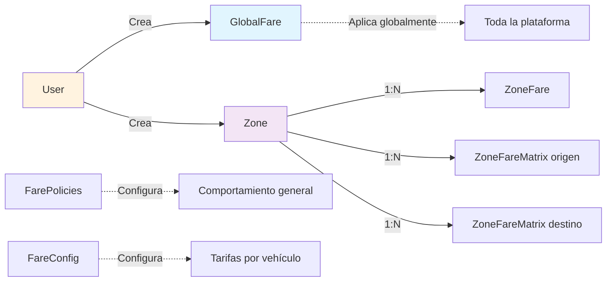
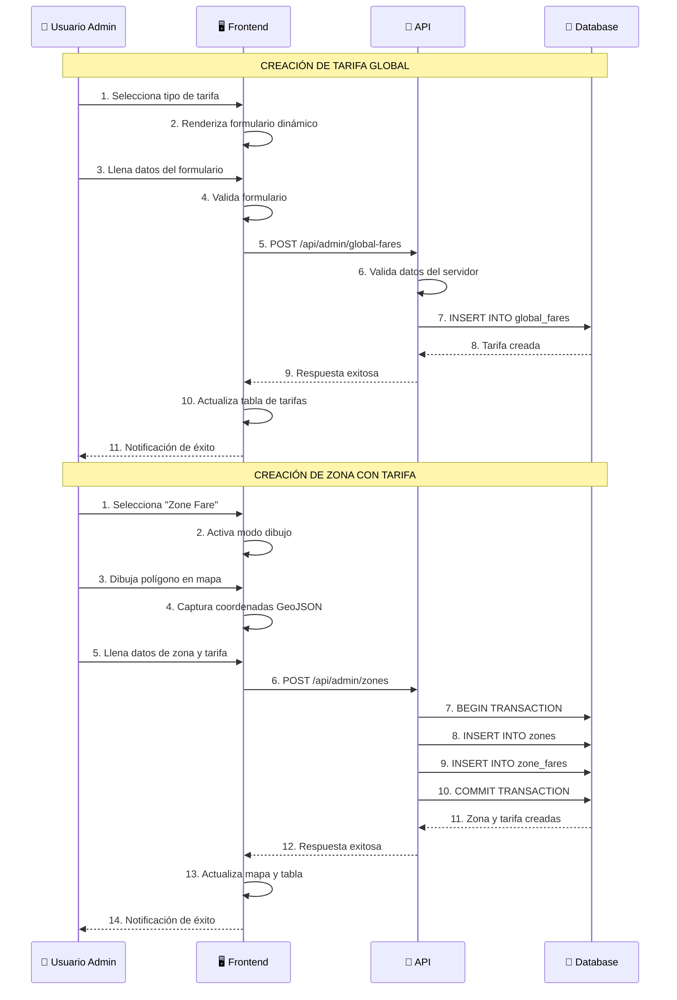

# 📊 DIAGRAMA VISUAL: SCHEMAS DE TARIFAS Y FLUJO DE CREACIÓN

## 🏗️ ARQUITECTURA DE SCHEMAS DE TARIFAS



## 🔄 FLUJO DE CREACIÓN DE TARIFAS

### 1️⃣ TARIFAS GLOBALES (Sin Zona Geográfica)



### 2️⃣ TARIFAS POR ZONA (Con Polígono Geográfico)



## 📊 TIPOS DE TARIFAS Y SUS CAMPOS

### 🌍 TARIFAS GLOBALES (GlobalFare)

| Tipo | Campos Principales | Descripción |
|------|-------------------|-------------|
| **base_fare** | `baseFare`, `currency` | Tarifa mínima global |
| **per_kilometer** | `perKmRate`, `currency`, `surgeMultiplier`, `cancellationFee` | Costo adicional por km |
| **per_hour** | `perMinuteRate`, `currency`, `surgeMultiplier`, `cancellationFee` | Costo adicional por hora |

### 🗺️ TARIFAS POR ZONA (ZoneFare)

| Tipo | Campos Principales | Descripción |
|------|-------------------|-------------|
| **zone_fare** | `baseFare`, `currency`, `surgeMultiplier`, `cancellationFee` | Tarifa fija por zona |

## 🔗 RELACIONES ENTRE SCHEMAS



## 🎯 ENDPOINTS Y OPERACIONES

### 📡 ENDPOINTS PRINCIPALES

```
🌍 TARIFAS GLOBALES:
├── POST   /api/admin/global-fares          → Crear tarifa global
├── GET    /api/admin/global-fares          → Listar tarifas globales
├── PUT    /api/admin/global-fares/:id      → Actualizar tarifa global
├── PATCH  /api/admin/global-fares/:id/toggle → Activar/desactivar
└── DELETE /api/admin/global-fares/:id      → Eliminar tarifa global

🗺️ TARIFAS POR ZONA:
├── POST   /api/admin/zones                 → Crear zona + tarifa
├── GET    /api/admin/zones                 → Listar zonas
├── PUT    /api/admin/zones/:id             → Actualizar zona
├── PATCH  /api/admin/zones/:id/toggle      → Activar/desactivar zona
└── DELETE /api/admin/zones/:id             → Eliminar zona
```

## 🔄 FLUJO DE DATOS COMPLETO



## 🎨 DIFERENCIAS CLAVE ENTRE TIPOS DE TARIFAS

### 🌍 **TARIFAS GLOBALES**
- ✅ **NO requieren** polígono geográfico
- ✅ **Aplican** en toda la plataforma
- ✅ **Se almacenan** en tabla `global_fares`
- ✅ **Tipos**: `base_fare`, `per_kilometer`, `per_hour`

### 🗺️ **TARIFAS POR ZONA**
- ✅ **REQUIEREN** polígono geográfico
- ✅ **Aplican** solo dentro de la zona
- ✅ **Se almacenan** en tablas `zones` + `zone_fares`
- ✅ **Tipos**: `zone_fare` (tarifa fija)

## 🔧 CONFIGURACIÓN DE FORMULARIOS DINÁMICOS

```javascript
// Mapeo de tipos de tarifa a formularios
const FARE_FORM_MAPPING = {
  'base_fare': BaseFareForm,        // Solo baseFare + currency
  'per_kilometer': PerKilometerFareForm, // Solo perKmRate + extras
  'per_hour': PerHourFareForm,      // Solo perHourRate + extras
  'zone_fare': ZoneFareForm         // baseFare como tarifa fija
};

// Campos por tipo de tarifa
const FARE_FIELDS = {
  base_fare: ['baseFare', 'currency'],
  per_kilometer: ['perKmRate', 'currency', 'surgeMultiplier', 'cancellationFee'],
  per_hour: ['perHourRate', 'currency', 'surgeMultiplier', 'cancellationFee'],
  zone_fare: ['baseFare', 'currency', 'surgeMultiplier', 'cancellationFee']
};
```

## 📋 RESUMEN DE IMPLEMENTACIÓN

### ✅ **COMPLETADO**
1. **Schemas de base de datos** definidos correctamente
2. **Formularios dinámicos** para cada tipo de tarifa
3. **Separación clara** entre tarifas globales y por zona
4. **Validaciones** en frontend y backend
5. **Tabla unificada** que muestra ambos tipos de tarifas
6. **Operaciones CRUD** completas para ambos tipos

### 🎯 **CARACTERÍSTICAS CLAVE**
- **Tarifas independientes**: Base, por kilómetro y por hora son tipos separados
- **Sin confusión**: Cada tipo tiene su propio formulario sin campos innecesarios
- **Flexibilidad**: Soporte para múltiples monedas y configuraciones
- **Auditoría**: Tracking de quién crea y modifica las tarifas
- **Geolocalización**: Soporte completo para zonas geográficas con PostGIS

---

*Este diagrama muestra la arquitectura completa del sistema de tarifas, desde los schemas de base de datos hasta el flujo de creación en la interfaz de usuario.*