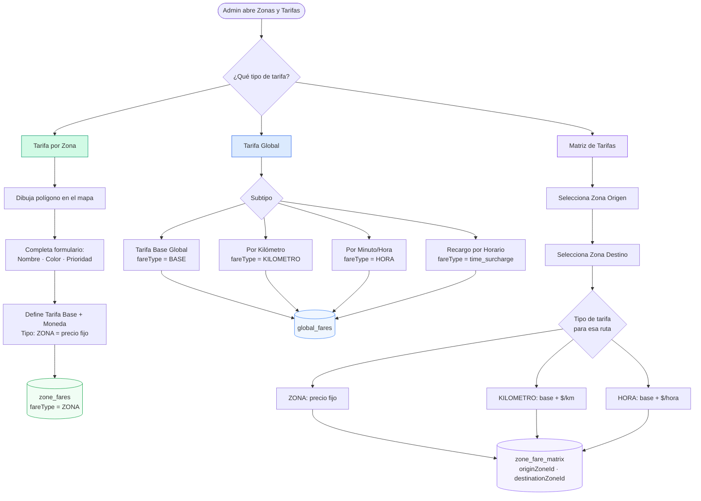
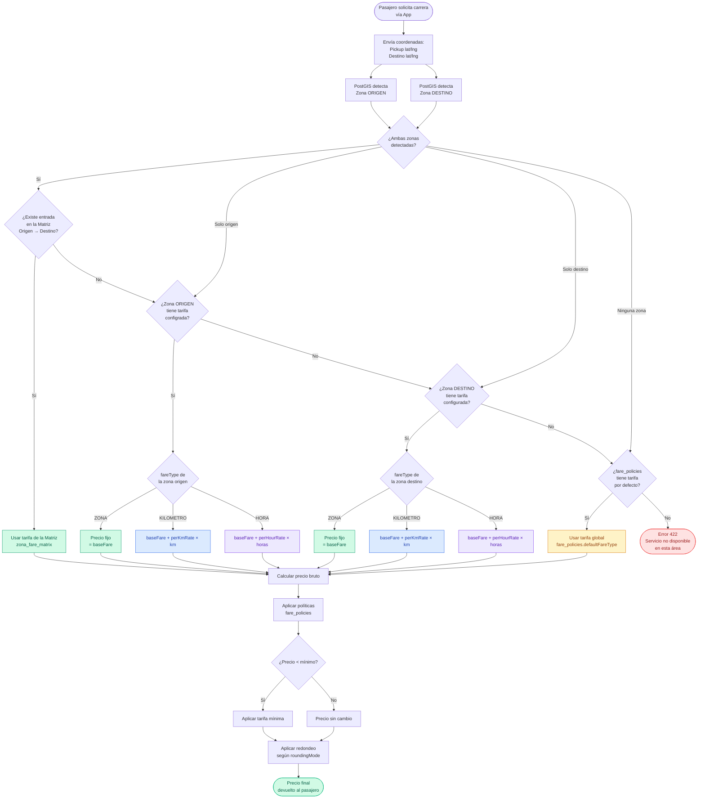

# Flujo del Sistema de Tarifas — UrbanTaxi

## 1. Creación de Tarifas (Panel Admin)



---

## 2. Flujo de Solicitud de Carrera y Aplicación de Tarifa



---

## 3. Prioridad de Tarifas (resumen)

| Prioridad | Fuente | Condición |
|-----------|--------|-----------|
| **1 — Más específica** | Matriz `zone_fare_matrix` | Existe entrada para Origen → Destino |
| **2** | Tarifa zona ORIGEN `zone_fares` | Origen detectado, sin entrada en matriz |
| **3** | Tarifa zona DESTINO `zone_fares` | Destino detectado, origen fuera de cobertura |
| **4 — Más general** | Política global `fare_policies` | Ninguna zona detectada |
| **Error** | — | Sin política por defecto configurada |

---

## 4. Tipos de Tarifa y su Fórmula

| fareType | Fórmula | Cuándo usarla |
|----------|---------|---------------|
| `ZONA` | `precio = baseFare` (fijo) | Precio único dentro de la zona, sin importar distancia ni tiempo |
| `KILOMETRO` | `precio = baseFare + perKmRate × km` | Viajes donde la distancia es el factor principal |
| `HORA` | `precio = baseFare + perHourRate × horas` | Servicios de espera o trayectos lentos |
| `BASE` | `precio = baseFare` (global) | Tarifa mínima global cuando no hay zona configurada |

---

## 5. Cuándo se usa cada tipo de tarifa (casos reales)

```
Pasajero en Centro → Aeropuerto
  └─ Existe en Matriz: Centro→Aeropuerto = 1500 Bs  ✓ usa Matriz

Pasajero en Zona Norte → Zona Sur
  └─ No existe en Matriz
  └─ Zona Norte tiene tarifa ZONA = 800 Bs           ✓ usa Zona Origen

Pasajero en carretera (fuera de zona) → Zona Centro
  └─ No existe en Matriz (origen sin zona)
  └─ Zona Centro tiene tarifa KILOMETRO              ✓ usa Zona Destino

Pasajero en área rural → área rural
  └─ Ninguna zona detectada
  └─ fare_policies.defaultFareType = BASE = 500 Bs   ✓ usa Política Global
```
